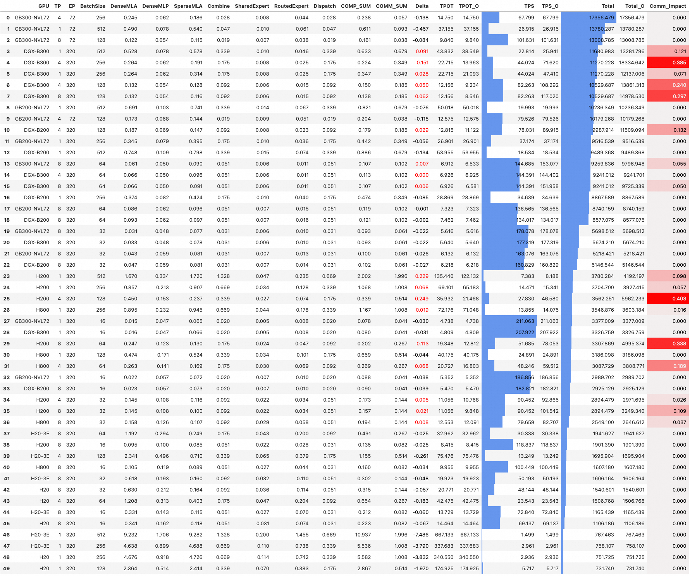
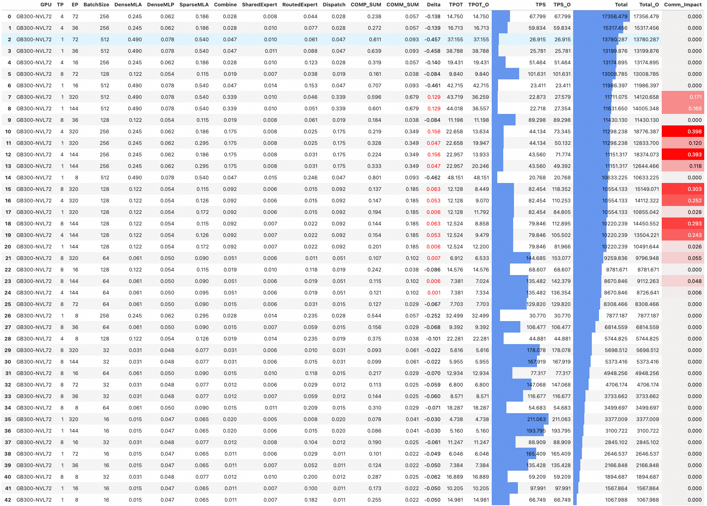
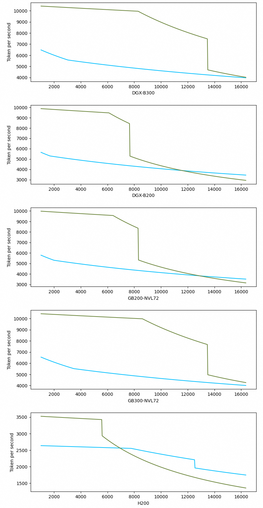

# Shallow Sim

ShallowSim is a simulator used for analyzing the inference performance of the DeepSeek-V3/R1 model.

This project primarily focuses on the optimal design of model architectures for different GPU architectures, as well as the analysis of interconnect bus requirements for Scale-Up and Scale-Out scenarios.

```python
import shallowsim as sb 

args = sb.ModelArgs()
c = sb.Config()
gpu_list = sb.get_gpu_info('./device/gpu_info.csv', 
                            decoding_mode=True, print_console=True) 

dfs = sb.decode_time_with_ep_list(args,gpu_list,c,print_console=False,fp8_combine=True)
```
## Summary Report 

```python
dfs_o = dfs.groupby(['GPU','BatchSize'],as_index=False).apply(lambda t: t[t.Total==t.Total.max()]).sort_values(['Total'],ascending=False).reset_index(drop=True)
dfs_o.style.bar(subset=['TPS','Total'],color='#6495ED').applymap(sb.color_positive_red, subset=['Delta']).background_gradient(subset=['Comm_Impact'],cmap=sb.cm).format(precision=3) 
```


## Sort by GPU

```python
gpu = 'GB300-NVL72'
tps_limit = 20

tdf = sb.df_filter(dfs,gpu,tps_limit=tps_limit)
sb.df_sort(tdf,value='Total',ascending=False).style.bar(subset=['TPS','Total'],color='#6495ED').applymap(sb.color_positive_red, subset=['Delta']).background_gradient(subset=['Comm_Impact'],cmap=sb.cm).format(precision=3) 
```


## Sequence Length analysis

1. Generate data

```python
dfs = []
for seq_len in range(1024,16384,32):
    c.seq_len = seq_len
    df = sb.decode_time_with_ep_list(args,gpu_all_decode,c,fp8_combine=True)
    df['Seq_len'] = seq_len
    df_o = df.groupby(['GPU','BatchSize','EP'],as_index=False).apply(lambda t: t[t.Total==t.Total.max()]).sort_values(['Total'],ascending=False).reset_index(drop=True)
    df_o.drop_duplicates(subset=['GPU','BatchSize','EP'], keep='first', inplace=True)
    dfs.append(df_o)
df = pd.concat(dfs)    
df.reset_index(inplace=True,drop=True)
df.to_csv('perf_vs_seq_len.csv')
```

2. Load data and plot
```python
df = pd.read_csv('perf_vs_seq_len.csv')
df['BatchSize']= df['BatchSize'].astype(int).astype(str)

# filert on EP

df1 = df[df['EP'] == 144].reset_index(drop=True)

# plot
sb.draw(df1, gpu_all_decode, 'Total','Token per second')
```

